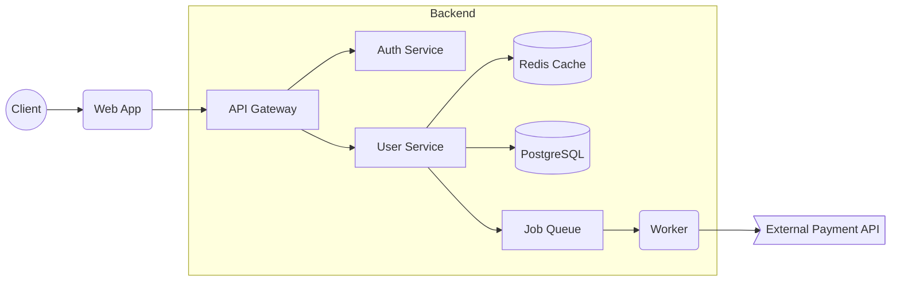

# System Overview

A sample local-first web service architecture used to explore AgentCanvas.

## Tasks

- [ ] Auth Service の codeRef を追加 (todo)
- [ ] Redis fallback設計を書く (todo)
- [ ] Worker retry policy を決める (todo)

## Notes

- warning: RedisのTTL方針が未定義
- risk: Payment API失敗時のretry/backoffが必要

## Comments

No comments.
